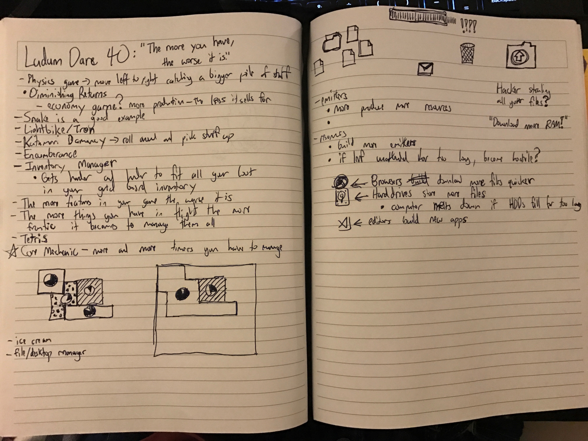

[Prev Day](../01/README.md) - [Devember Home](../README.md) - [Next Day](../03/README.md)

# Devember 2nd

## Ludum Dare 40

The theme is "The More You Have, the Worse it Gets"! Of the other top themes, this was not one of the ones I was very excited about. I spent the most of Friday night brainstorming to try and come up with a game idea. This took me _hours_. 

After that I got a boilerplate project set up and running [here](https://github.com/rmkubik/ldjam40). 

Later in the day I managed to get Draggable components working and had some frustrating fights with the `CSSTransitionGroup` component. I tweeted [what I managed to get done](https://twitter.com/ryrykubes/status/936847019670306816) on Day #2. 

I gave up on getting the new `react-transition-group` library in favor of the old `react-addons-css-transition-group` library. I figured that I didn't want to spend too much of my time trying to figure out an animation library when I already knew how one worked.

My final sin of the day was storing React components in the state of my React app. Fortunately, I've now learned why this is a terrible idea and won't ever have to make that mistake again! 
