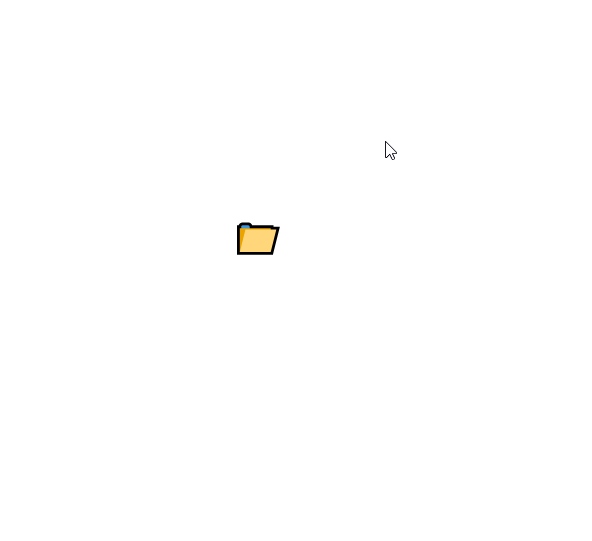
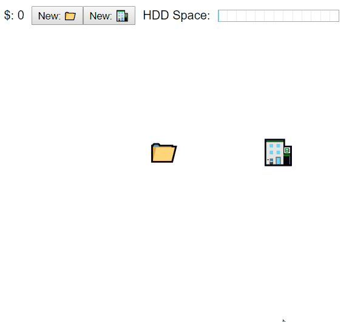

[Prev Day](../02/README.md) - [Devember Home](../README.md) - [Next Day](../04/README.md)

# Devember 3rd

## Ludum Dare 40

The final day of Ludum Dare! Today I actually had most of the day to wrap up my project unlike my busy day yesterday.

>[The best debugger ever made is a good night's sleep.](https://twitter.com/SashaLaundy/status/936661004137635840)

I saw the above on Twitter and it is truly the best debugging advice I've ever received. For whatever reason all of yesterday's problems with my React state and undefined variables became clear. Today I ended up creating the vast majority of the game's features, spawners, consumers, and the hdd/storage space mechanic. 

### In Progress GIFs:

My final piece of experimentation was deploying my first React app. Create React App comes with a built in `yarn build` script which creates your build files in the `/build` directory. 

I did a quick static deploy of React using [Surge](https://surge.sh) first off. This worked pretty well for sharing my app quickly, but didn't allow me to have a URL that made sense (without configuring a custom URL).

I wanted to get everything running on [Itch.io](https://itch.io) because its a popular platform for Ludum Dare and my other projects are hosted there. Create React App expects to be deployed as a static server in the root directory. However, Itch doesn't host your projects in this manner. I had to modify my `package.json` file with the value `"homepage": "."` to make the build process be dynamic. 

The final piece of deploying my project to Itch.io was to make use of their command line interface deployment tool [Butler](https://itch.io/docs/butler/). It's a really cool tool that makes it much more painless to deploy a patch to your project. Instead of zipping a bunch of files, navigating to the site, and uploading your files you just type `butler push build law5guy/infinite-desktop-icons:html`.